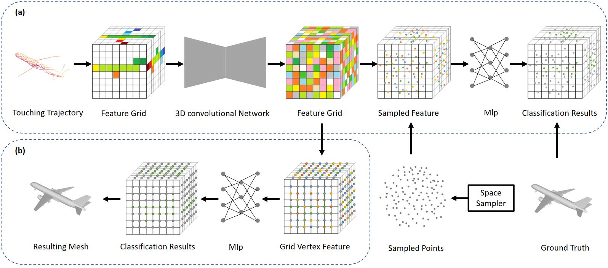

# TouchNet

This repository contains the source code for the paper [End-to-end Surface Reconstruction For Touching Trajectories]()



## Cite this work

```
@inproceedings{liu2021touchnet,
  title={End-to-end Surface Reconstruction For Touching Trajectories},
  author={Liu, Jiarui and 
          Zhang, Yuanpei and 
          Zou, Zhuojun and 
          Hao, Jie},
  booktitle={ACCV},
  year={2022}
}
```

## Datasets

Our datasets are available below:

- [Mug](https://pan.baidu.com/s/1yx9fyQOgfcAooFAO1uZB0g?pwd=gzuo) (extraction code: gzuo)
- [Airplane](https://pan.baidu.com/s/1Bzbek9tz-6gdHli3RF7sfA?pwd=ogeq) (extraction code: ogeq)
- [Car](https://pan.baidu.com/s/17D41cSG3t0j_cjKTojE_nQ?pwd=syef) (extraction code: syef)

## Pretrained Models

The pretrained models are available as follows:

- [Mug](https://drive.google.com/file/d/1y0ZnV0e5qF0QB9fJabzjtTIor4k3xADw/view?usp=sharing)
- [Airplane](https://drive.google.com/file/d/1tREmx6kcxJdQJCegzEQk9a6izID4B_Hc/view?usp=sharing)
- [Car](https://drive.google.com/file/d/1DkSNUXn24nJWRJsDil1IG3aqyTZGvuS3/view?usp=sharing)
## Prerequisites

#### Clone the Code Repository

```
git clone https://github.com/LiuLiuJerry/ShapeNetProcessing.git 
```
Note that this code is partly based on [GRNet](https://github.com/hzxie/GRNet)

#### Install Python Denpendencies

```
cd TouchNet
pip install -r requirements.txt
```

#### Update Settings in `config.py`

You need to update the file path of the datasets:

```
__C.DATASETS.SHAPENETTOUCH.CATEGORY_FILE_PATH         = 'path/to/datasets/datasetname/ShapeNetTouch.json'
__C.DATASETS.SHAPENETTOUCH.PARTIAL_POINTS_PATH        = 'path/to/datasets/datasetname/%s/partial/%s/%s/path2048_%.2d.pcd'
__C.DATASETS.SHAPENETTOUCH.COMPLETE_POINTS_PATH       = 'path/to/datasets/datasetname/%s/complete/%s/%s/01.pcd'
__C.DATASETS.SHAPENETTOUCH.MESH_PATH                  = 'path/to/datasets/datasetname/%s/complete/%s/%s/simplified.obj' 
```

## Get Started

To train TouchNet, you can simply use the following command:

```
python3 runner.py
```

To test TouchNet, you can use the following command:

```
python3 runner.py --test=Ture --weights=/path/to/pretrained/model.pth
```

To generate new mesh from TouchNet, you can use the following command:
```
python3 runner.py --test=False --inference=True --weights=/path/to/pretrained/model.pth
```

